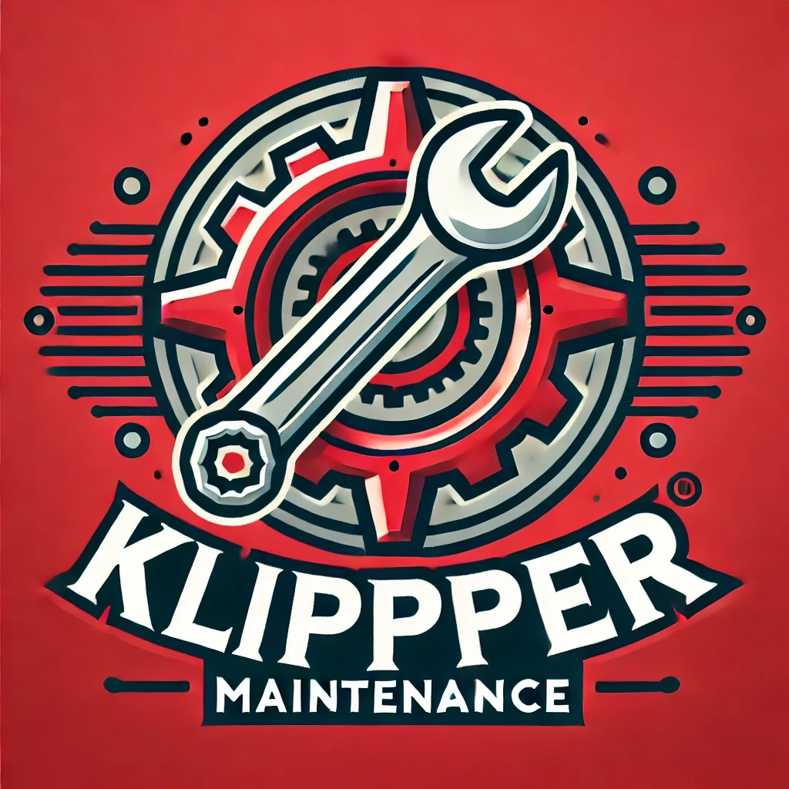

# Klipper Maintenance

**Keep your 3D printer running smoothly**

---

## Features

Klipper Maintenance supports the following features:

- Maintenance reminders in the terminal
- Maintenance reminders on the printer display
- Print time thresholds
- Filament thresholds
- Time thresholds

## Get Started

Follow [Installation](install.md) to get started with Klipper Maintenance.

## Configuration

After installing KlipperMaintenance, follow [Configuration](config.md) to configure KlipperMaintenance.

## Usage

To use KlipperMaintenance, follow [G-Codes](gcodes.md).